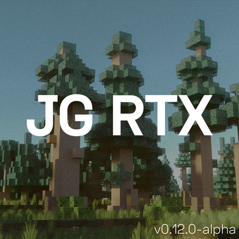

# JG RTX

> ### Minecraft resource packs in development.

__Like my work?__
~~Buy Me a Coffee~~ __[DONATE TO DOCTORS WITHOUT BORDERS](https://donate.doctorswithoutborders.org/monthly.cfm)__

---


## Read before cloning:

__You're probably looking for the [.mcpack of the latest release](https://github.com/jasonjgardner/jg-rtx/releases)__. A resource pack archive is attached to each release (under _Assets_ section). Download __JG-RTX.mcpack__ to use textures in Minecraft.

Downloading the entire repository will include build scripts and excess textures, which are not required to play or install the resouce pack.

# Installation Options

## Download resource pack archive (Recommended)
Download and open [latest release's](https://github.com/jasonjgardner/jg-rtx/releases) **.mcpack** archive.

## Download repository (For latest work)

Clone and copy resource packs into Minecraft's `development_resource_packs` directory with one of the following methods:

### Download Repository Archive
1. [Download repository .zip](https://github.com/jasonjgardner/jg-rtx/archive/master.zip)
2. Extract contents of [development_resource_packs](development_resource_packs) directory from repository archive into your Windows 10 Minecraft installation directory:
`%LocalAppData%\Packages\Microsoft.MinecraftUWP_8wekyb3d8bbwe\LocalState\games\com.mojang\development_resource_packs`

### CLI
```shell
git clone --depth 1 https://github.com/jasonjgardner/jg-rtx.git
```

To install latest JG RTX resources:

```shell
xcopy /E /I jg-rtx\development_resource_packs\JG-RTX\ %LocalAppData%\Packages\Microsoft.MinecraftUWP_8wekyb3d8bbwe\LocalState\games\com.mojang\development_resource_packs\JG-RTX
```

Or to install *all* development resource packs in this repository:

```shell
xcopy /E /I jg-rtx\development_resource_packs %LocalAppData%\Packages\Microsoft.MinecraftUWP_8wekyb3d8bbwe\LocalState\games\com.mojang\development_resource_packs
```

### VS Code

Open the repository in VS Code to have an _"Install JG RTX"_ build task available in the command palette.

## Updates

If you've previously installed JG RTX:

1. Way to go
2. Uninstall older versions:


Open Minecraft → Settings → General → Storage → Resource Packs → Find _JG RTX (Preview)_ versions below [latest tag](https://github.com/jasonjgardner/jg-rtx/tags).

> New releases come with new UUIDs. This makes .mcpack installation easier and allows players to keep older versions of resouce packs installed. [But there's a catch...](https://github.com/jasonjgardner/jg-rtx/discussions/17)

---

## Try the textures in [Mineways](http://mineways.com)
[Mineways 8.0](https://github.com/erich666/Mineways/releases/tag/v8.00) includes JG RTX. [It looks pretty damn good.](http://www.realtimerendering.com/erich/minecraft/public/mineways/textures.html#candy)

---

## License
<a rel="license" href="http://creativecommons.org/licenses/by-nc-sa/4.0/"></a>

<em xmlns:dct="http://purl.org/dc/terms/" property="dct:title">JG RTX</em> is licensed under a <a rel="license" href="http://creativecommons.org/licenses/by-nc-sa/4.0/">Creative Commons Attribution-NonCommercial-ShareAlike 4.0 International License</a>.

## Credits
- Made with Substance and Photoshop.
	- Sourced from [Substance Share](https://share.substance3d.com/), [Substance Source](https://source.substance3d.com/), [GameTextures.com](https://gametextures.com/), [CC0 Textures](https://cc0textures.com/), [3D Textures](https://3dtextures.me/), and [Envato Elements](https://elements.envato.com/)
- Block textures, code, videos, and cool stuff by [Jason](https://github.com/jasonjgardner/)
