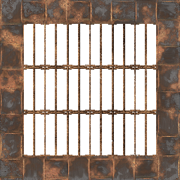

# JG RTX Blocks

> Minecraft resource pack in development.

__Like my work?__
~~Buy Me a Coffee~~ __[DONATE TO DOCTORS WITHOUT BORDERS](https://donate.doctorswithoutborders.org/monthly.cfm)__

## Screenshots
[Watch JG RTX demos on the YouTubes](https://youtube.com/playlist?list=PL8PY_n6h2FGXHHcfU4ifiWdeIYg8TNB8N)

> 
> 
> *Stained-glass window timelapse*

> 
>
> *Mushroom biome*

## Try the textures in [Mineways](http://mineways.com)
[Mineways 8.0](https://github.com/erich666/Mineways/releases/tag/v8.00) includes JG RTX. [It looks pretty damn good.](http://www.realtimerendering.com/erich/minecraft/public/mineways/textures.html#candy)

## Block Properties
This is my general approach to assigning textures to blocks.

__Concrete Powder__
- Used as building-material textures, or as textures which are not intended to be used on ceilings.
- Used for tileable textures.

__Concrete__
- Used for textures which do not appear correct if rotated.
- Used for ceiling textures.

__Terracotta__
- Used for textures that can be rotated arbitrarily.

__Glazed Terracotta__
- Used for marble and terrazzo textures.

__Education Blocks__
- Used for creative or excess textures.
- Noble gases are emissive.

## Download Assets
Please use the following Google Drive link to download Photoshop and Substance Painter assets used in this project:

[Google Drive](https://drive.google.com/drive/folders/1TtPpy-yjNDZpjd7pSJAcqL2FT-9k2Xtz?usp=sharing)

---

## License

<em xmlns:dct="http://purl.org/dc/terms/" property="dct:title">JG RTX</em> is licensed under a <a rel="license" href="http://creativecommons.org/licenses/by-nc-sa/4.0/">Creative Commons Attribution-NonCommercial-ShareAlike 4.0 International License</a>.

## Credits
- Made with Substance and Photoshop.
	- Sourced from [Substance Share](https://share.substance3d.com/), [Substance Source](https://source.substance3d.com/), [GameTextures.com](https://gametextures.com/), [CC0 Textures](https://cc0textures.com/), [3D Textures](https://3dtextures.me/)
- Block textures, code, videos, and cool stuff by [Jason](https://github.com/jasonjgardner/)

---

### So, what's with the cat stuff?

That's Carrots the Cat! She's an [Instagram influencer](https://instagram.com/jasonjgardner/). I think it's really amusing to include her in this resource pack.
Don't worry, I'll replace the cat paintings soon.